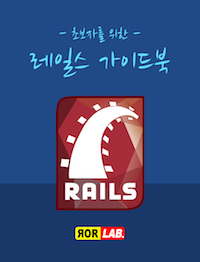

# 목차

* [소개](./introduction)
* [저자소개](contents/authors.html)
* [루비온레일스 소개](contents/rubyonrails_intro.html)
* [환경 준비](contents/environments.html)
   * [개발환경](contents/dev_env.html)
   * [Git 설치](contents/git.html)
   * [rbenv 설치](contents/rbenv.html)
   * [rvm 설치](contents/rvm.html)
   * [소스코드 에디터](contents/editors.html)
   * [서버 운영환경 구축](contents/pro_env.html)
* [레일스 설치](contents/rails/install.html)
   * [인스톨러를 이용한 설치](contents/rails/using_installer.html)
   * [맥 OSX 개발머신에 설치하기](contents/rails/mac_install.html)
   * [리눅스 개발머신에 설치하기](contents/rails/linux_install.html)
   * [윈도우 개발머신에 설치하기](contents/rails/windows_install.html)
* [프로젝트 따라하기](contents/walkthrough/start.html)
   * [Gemfile의 작성](contents/walkthrough/gemfile.html)
   * [welcome 컨트롤러의 생성](contents/walkthrough/welcome_controller.html)
   * [첫번째 모델의 생성](contents/walkthrough/first_model.html)
   * [어플리케이션 레이아웃의 작성](contents/walkthrough/layout.html)
   * [posts CRUD 살펴보기](contents/walkthrough/posts_CRUD.html)
   * [Bulletin 모델의 생성](contents/walkthrough/bulletin.html)
   * [모델 관계선언](contents/walkthrough/model_association.html)
   * [posts 컨트롤러 변경](contents/walkthrough/posts_controller_modified.html)
   * [posts 뷰 변경](contents/walkthrough/posts_view_file.html)
   * [게시판 레이아웃 작성하기](contents/walkthrough/bulletin_type.html)
   * [갤러리형 레이아웃 작성하기](contents/walkthrough/gallery_layout.html)
   * [flash 메시지 표시하기](contents/walkthrough/flash_message.html)
   * [기본 데이터 추가하기](contents/walkthrough/rake_seed.html)
   * [코멘트 달기](add_comments/README.html)
   * [태그 달기](contents/walkthrough/add_tags.html)
   * [서버로 배포하기](contents/walkthrough/deploy_to_server.html)
* [프로젝트 배포하기](deployment/first.html)
   * [Capistrano 3를 이용한 배포](deployment/capfile.html)
   * [SSHKit 사용법](deployment/sshkit.html)
   * [SSHKit의 사용예제](deployment/deployrb.html)
   * [Capistrano 2.x 에서 업그레이드하기](deployment/cap2_to_3.html)
* [부록](appendices/appendix.html)
   * [공동집필에 참여하기](appendices/collaboration.html)
   * [액티브레코드란?](appendices/active_record.html)
   * [ImageMagick 설치하기](appendices/imagemagick.html)
   * [PostgreSQL 설치하기](appendices/postgresql_install.html)
   * [우분투 12.04 서버 세팅하기](appendices/ubuntu_12_4_setting.html)
   * [우분투 14.04 서버 세팅하기 (Virtual Box)](appendices/ubuntu14server.html)
   * [Heroku에 배포하기](appendices/heroku.html)
   * [AWS S3 사용하기](appendices/aws_s3.html)
   * [개발 환경변수를 관리하는 dotenv 젬](appendices/dotenv.html)
   * [맥전용 랙서버 POW](appendices/pow.html)
   * [추천 웹사이트 및 블로그](appendices/blogs.html)
   * [추천도서](appendices/books.html)
   * [추천동영상](appendices/screencasts.html)
   * [변경내역](appendices/change_logs.html)

